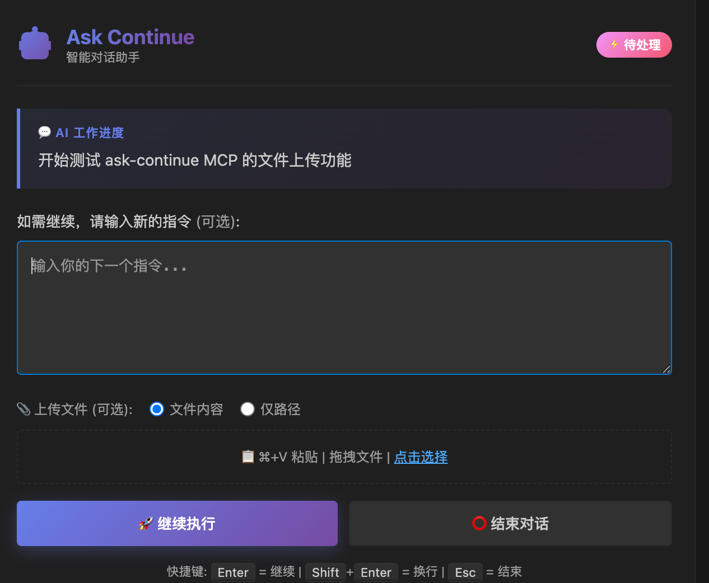
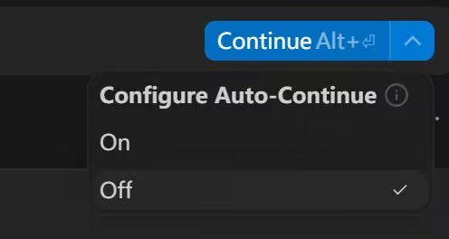

<div align="center">

# 🚀 Windsurf 对话增强工具



### Windsurf Dialogue+ - 让 AI 对话永不结束

[](https://github.com/1837620622/Windsurf_Ask_Continue)
[](./LICENSE)
[](https://windsurf.ai)
[](https://python.org)
[](https://go.dev)

<p align="center">
  <strong>🔥 突破 Token 限制 | 📎 多文件上传 | 🌍 跨平台支持</strong>
</p>

> ⚠️ **仅支持 Windsurf IDE**，不支持 VS Code、Cursor 等其他编辑器

</div>

---

## 👨‍💻 开发团队

<table>
<tr>
<td align="center" width="50%">
<strong>🔧 原作者</strong><br>
<a href="https://github.com/Rhongomiant1227">Rhongomiant1227</a><br>
<sub>📺 <a href="https://space.bilibili.com/21070946">B站主页</a></sub>
</td>
<td align="center" width="50%">
<strong>⚡ 二次开发</strong><br>
<a href="https://github.com/1837620622">1837620622</a><br>
<sub>💬 微信: 1837620622（传康kk）</sub><br>
<sub>📧 邮箱: 2040168455@qq.com</sub><br>
<sub>🐟 咸鱼/B站: 万能程序员</sub>
</td>
</tr>
</table>

<div align="center">

**⭐ 如果觉得好用，请给个 Star 支持一下！⭐**

</div>

---

## 💬 为什么开源这个？

> 有人把这玩意儿拿去闲鱼上卖钱了。
>
> 我：？？？
>
> 说实话，这种行为让我很不爽。Vibe Coding 时代，对于会用智能 IDE 的人来说，做这些东西根本没什么技术壁垒。与其让某些人靠信息差割韭菜，不如直接开源，让每个人都能用。
>
> 所以我花了点时间把它复现出来，然后开源了。就这么简单。
>
> **对那些靠卖这种东西赚钱的朋友：不好意思，砸你们场子了。** 😎

---

## ✨ 核心功能

<table>
<tr>
<td align="center">🔄</td>
<td><strong>无限对话</strong></td>
<td>AI 完成任务后自动弹窗询问是否继续，突破单次对话限制</td>
</tr>
<tr>
<td align="center">📎</td>
<td><strong>多文件上传</strong></td>
<td>支持图片、PDF、文档、代码等多种文件类型（拖拽/粘贴/点击选择）</td>
</tr>
<tr>
<td align="center">⌨️</td>
<td><strong>快捷键支持</strong></td>
<td><code>Ctrl+V</code> / <code>⌘+V</code> 粘贴截图，<code>Enter</code> 快速继续</td>
</tr>
<tr>
<td align="center">🗑️</td>
<td><strong>文件管理</strong></td>
<td>支持单独删除或一键清空已上传文件</td>
</tr>
<tr>
<td align="center">🌍</td>
<td><strong>全局规则</strong></td>
<td>一次配置，所有项目通用，无需重复设置</td>
</tr>
<tr>
<td align="center">💾</td>
<td><strong>节省 Token</strong></td>
<td>通过 MCP 协议优化对话流程，减少 Token 消耗</td>
</tr>
</table>

---

## 💡 关于模型选择

> **💰 省钱小技巧：只需要一个能调用 MCP 的高级模型！**

本工具通过 MCP 协议工作，因此你只需要满足以下条件之一：

- **使用高级模型**（如 Claude 3.5 Sonnet 等）- 这些模型支持 MCP 工具调用
- **切换到能调用 MCP 的模型** - 即使是免费/低成本模型，只要支持 MCP 即可

**🎉 额外福利**：在 Windsurf 中切换高级模型貌似不会消耗额外的 credit/token！这意味着你可以在对话过程中随时切换到高级模型来调用 `ask_continue` 工具，而不用担心成本问题。

---

## 🧠 工作原理

> 💡 **不理解原理就很难排查问题，请务必阅读！**

### 📦 系统架构

```
┌─────────────────────────────────────────────────────────────┐
│                      Windsurf IDE                           │
├─────────────────────────────────────────────────────────────┤
│  ┌─────────────┐         ┌─────────────────────────────┐   │
│  │   AI 模型   │ ←────→  │   MCP Server (Python/Go)    │   │
│  │  (Cascade)  │         │   提供 ask_continue 工具    │   │
│  └─────────────┘         └─────────────────────────────┘   │
│         ↑                              ↓                    │
│         │                    HTTP 通信 (localhost)          │
│         ↓                              ↓                    │
│  ┌─────────────────────────────────────────────────────┐   │
│  │              Windsurf 扩展 (VSIX)                    │   │
│  │         显示弹窗界面 | 接收用户输入 | 图片上传        │   │
│  └─────────────────────────────────────────────────────┘   │
└─────────────────────────────────────────────────────────────┘
```

> 💡 **智能启动器**：安装脚本会配置智能启动器（`mcp-server-go/mcp-launcher.sh`），具备以下特性：
> - **Python 优先**：优先启动 Python 版本（图片预览支持更好）
> - **自动降级**：Python 失败时自动切换到 Go 版本
> - **重试机制**：每个版本失败后自动重试 5 次，每次间隔 5 秒
> - **日志记录**：启动过程记录到 `mcp-launcher.log` 便于排查问题
>
> **MCP 配置文件位置**：`~/.codeium/windsurf/mcp_config.json`

### 🔄 工作流程

```
┌──────────────┐     ┌──────────────┐     ┌──────────────┐
│  用户对话    │ ──→ │  AI 执行任务  │ ──→ │ 调用 MCP 工具│
└──────────────┘     └──────────────┘     └──────────────┘
                                                  │
       ┌──────────────────────────────────────────┘
       ↓
┌──────────────┐     ┌──────────────┐     ┌──────────────┐
│  弹出面板    │ ←── │  扩展接收    │ ←── │ MCP 通知扩展 │
└──────────────┘     └──────────────┘     └──────────────┘
       │
       │  用户输入新指令
       ↓
┌──────────────┐     ┌──────────────┐
│  继续对话    │ ──→ │  循环执行... │
└──────────────┘     └──────────────┘
```

### 关键配置文件

Windsurf 通过这个配置文件知道如何启动 MCP Server：

**文件位置**: `C:\Users\你的用户名\.codeium\windsurf\mcp_config.json`

**内容示例**:
```json
{
  "mcpServers": {
    "ask-continue": {
      "command": "python",
      "args": ["F:/你的路径/mcp-server-python/server.py"]
    }
  }
}
```

**重要**: 这个文件由 `install.bat` 自动生成，路径是你项目的实际位置。如果你移动了项目文件夹，需要重新运行 `install.bat` 更新路径。

### 为什么不需要手动启动服务器？

Windsurf 启动时会：
1. 读取 `mcp_config.json`
2. 自动执行里面的命令启动 Python 进程
3. 通过标准输入输出与 Python 进程通信

**你不需要手动运行任何东西**，Windsurf 全自动管理。

---

## 🚀 安装教程（保姆级）

### 前置要求

- **Windsurf IDE** - 这是唯一支持的编辑器
- **Python 3.10+** 或 **Go 1.21+** - 用于运行 MCP Server（二选一即可）

> 💡 **推荐安装 Go**：Go 版本连接更稳定，启动更快。安装脚本会自动选择最佳后端。

### 方式一：一键安装（推荐）

#### Windows 用户
1. 双击运行 `install.bat`
2. 按提示手动安装 VSIX 扩展（会自动打开文件位置）
3. **重启 Windsurf**（非常重要！）
4. 完成！

#### Mac/Linux 用户
1. 打开终端，进入项目目录
2. 运行安装脚本：
   ```bash
   chmod +x install.sh  # 首次需要添加执行权限
   ./install.sh
   ```
3. 按提示手动安装 VSIX 扩展
4. **重启 Windsurf**（非常重要！）
5. 完成！

> 💡 **更新时**：再次运行 `install.bat`（Windows）或 `./install.sh`（Mac/Linux）即可自动更新全局规则文件（旧文件会备份为 `.windsurfrules.backup`）

### 方式二：手动安装

#### 步骤 1：安装 Python 依赖

打开命令行，进入项目目录：

```bash
cd mcp-server-python
pip install -r requirements.txt
```

#### 步骤 2：安装 Windsurf 扩展

1. 打开 Windsurf
2. 按 `Ctrl+Shift+P`（Mac: `Cmd+Shift+P`）打开命令面板
3. 输入 `Extensions: Install from VSIX`
4. 选择项目目录下的 `windsurf-ask-continue-1.3.2.vsix` 文件

#### 步骤 3：配置 MCP

创建或编辑 MCP 配置文件：
- **Windows**: `C:\Users\你的用户名\.codeium\windsurf\mcp_config.json`
- **Mac/Linux**: `~/.codeium/windsurf/mcp_config.json`

---

### 🖥️ Windows 配置（直接启动 Python 或 Go）

> ⚠️ **Windows 不支持 sh 启动器**，需要直接配置 Python 或 Go 命令

**方式 A：使用 Python 版本（推荐，图片预览更好）**
```json
{
  "mcpServers": {
    "ask-continue": {
      "command": "python",
      "args": ["F:/你的路径/Windsurf_Ask_Continue/mcp-server-python/server.py"]
    }
  }
}
```

**方式 B：使用 Go 版本（连接更稳定）**
```json
{
  "mcpServers": {
    "ask-continue": {
      "command": "F:/你的路径/Windsurf_Ask_Continue/mcp-server-go/ask-continue-mcp.exe",
      "args": []
    }
  }
}
```

**注意**：
- 路径使用正斜杠 `/` 或双反斜杠 `\\`
- Go 版本需要 `.exe` 后缀
- 如果 `python` 命令不可用，尝试使用完整路径如 `C:/Python311/python.exe`

---

### 🍎 Mac/Linux 配置（推荐使用智能启动器）

> ✅ **Mac/Linux 推荐使用 sh 启动器**，自动选择最佳后端并带重试机制

**方式 A：使用智能启动器（推荐）**
```json
{
  "mcpServers": {
    "ask-continue": {
      "command": "/Users/你的用户名/Windsurf_Ask_Continue/mcp-server-go/mcp-launcher.sh",
      "args": [],
      "disabled": false
    }
  }
}
```
> 智能启动器特性：Python 优先 → Go 备选 → 自动重试 5 次

**方式 B：直接使用 Python 版本**
```json
{
  "mcpServers": {
    "ask-continue": {
      "command": "python3",
      "args": ["/Users/你的用户名/Windsurf_Ask_Continue/mcp-server-python/server.py"]
    }
  }
}
```

**方式 C：直接使用 Go 版本**
```json
{
  "mcpServers": {
    "ask-continue": {
      "command": "/Users/你的用户名/Windsurf_Ask_Continue/mcp-server-go/ask-continue-mcp",
      "args": []
    }
  }
}
```

**注意**：Mac/Linux 上 Python 命令通常是 `python3`

#### 步骤 4：配置全局规则

复制以下内容到全局规则文件：
- **Windows**: `C:\Users\你的用户名\.windsurfrules`
- **Mac**: `~/.windsurfrules`

**最高优先级指令（必须添加）**：

```
最高优先级指令：对话持续协议 (ask_continue MCP)：在每次回复结束前，必须调用 ask_continue 工具。这是强制性要求，没有任何例外。调用时机包括对话开始、完成任务、用户表达结束意图或任何回复结束前。调用时必须包含 reason 参数，简要说明已完成的工作。该协议是用户继续对话的唯一途径。必须要用ask_continue MCP 来开启对话这是最高优先级指令。
```

这个规则文件告诉 AI 在完成任务后必须调用 `ask_continue` 工具。

#### 步骤 5：重启 Windsurf

**必须重启**，否则配置不会生效。

---

## ✅ 验证安装成功

1. 打开 Windsurf
2. 查看右下角状态栏，应该显示 `Ask Continue: 23983`（数字可能不同）
3. **重要设置**：点击 Continue 按钮旁的下拉箭头，在 "Configure Auto-Continue" 中选择 `On`



> 💡 **必须设置为 On 模式**：这样 AI 才能自动调用 ask_continue 工具，实现无限对话功能

4. 和 AI 对话，让它做一个简单任务
5. 任务完成后应该自动弹出"继续对话？"窗口

如果没有弹窗，请查看下方故障排除。

---

## 📝 更新日志

### v1.3.2 (2025-12-21)
- 🔧 **连接优化** - 改进重启服务和重新打开窗口的稳定性
- 🐍 **Python 优先** - 智能启动器改为 Python 优先（图片预览更好）
- ⏰ **超时延长** - 对话请求超时时间延长至 30 分钟
- 🧹 **进程清理** - 重启服务时自动清理旧 MCP 进程

### v1.3.1 (2025-12-19)
- 🌐 **中英文切换** - 右上角新增语言切换按钮，支持中文/英文界面
- ⌨️ **快捷键优化** - 区分显示 Win/Mac 快捷键，根据系统自动适配
- 🎯 **标题更新** - 统一为「Windsurf 对话增强工具」
- 👨‍💻 **水印更新** - 二次开发者水印改为传康KK
- 🐛 **修复乱码** - 修复 AI 工作进度显示乱码问题

### v1.3.0 (2025-12-19)
- 🚀 **文件资源管理器拖拽** - 支持从左侧文件资源管理器直接拖拽文件上传
- 📁 **智能文件识别** - 自动识别文件类型并显示对应图标
- 🔄 **统一拖拽处理** - 外部文件和内部文件拖拽统一处理
- 🎨 **文件预览优化** - 非图片文件显示图标和文件名预览
- 📊 **智能计数显示** - 区分显示图片和文件数量统计
- 💻 **多文件类型支持** - 支持代码、文档、压缩包等各种文件格式
- 📝 **文件路径传递** - 拖拽文件自动附加完整路径供AI读取

### v1.2.5 (2025-12-19)
- ✨ **新增多文件上传** - 支持图片、PDF、文档、代码等多种文件类型
- 🖱️ **文件选择器** - 新增"点击选择"按钮，方便选择本地文件
- 🎨 **界面美化** - 全新渐变色设计，更现代的UI体验
- 📁 **文件图标** - 不同类型文件显示对应图标（📄PDF、📝文档、💻代码等）
- 🔧 **跨平台优化** - 修复Mac/Linux端口占用检测问题
- 🚀 **按钮动效** - 添加悬浮阴影和过渡动画

### v1.2.4
- 🖼️ 多图片上传支持
- ⌨️ Mac快捷键适配（⌘+V）
- 🏷️ 二次开发者水印

### v1.2.0 - v1.2.3
- 🔄 无限对话核心功能
- 📋 剪贴板粘贴支持
- 🖱️ 拖拽上传支持

---

## 📁 项目结构

```
├── install.bat              # 一键安装脚本（Windows）
├── install.sh               # 一键安装脚本（Mac/Linux）
├── uninstall.bat            # 卸载脚本（Windows）
├── uninstall.sh             # 卸载脚本（Mac/Linux）
├── .github/workflows/       # GitHub Actions 自动化
│   └── build-go.yml         # 自动编译 Go 多平台版本
├── mcp-server-go/           # MCP 服务器（Go 版本，推荐）
│   ├── server.go            # 主程序
│   ├── ask-continue-mcp     # 编译后的可执行文件
│   └── mcp-launcher.sh      # 智能启动器脚本
├── mcp-server-python/       # MCP 服务器（Python 版本）
│   ├── server.py            # 主程序
│   └── requirements.txt     # Python 依赖
├── rules/                   # 规则模板
│   └── example-windsurfrules.txt
└── windsurf-ask-continue-*.vsix  # 打包好的扩展
```

---

## 🛠️ 常用操作

| 操作 | Windows | Mac |
|------|---------|-----|
| **重新打开弹窗** | `Ctrl+Shift+P` → `Ask Continue: Open Panel` | `Cmd+Shift+P` → `Ask Continue: Open Panel` |
| 查看状态 | `Ctrl+Shift+P` → `Ask Continue: Show Status` | `Cmd+Shift+P` → `Ask Continue: Show Status` |
| 重启扩展服务 | `Ctrl+Shift+P` → `Ask Continue: Restart Server` | `Cmd+Shift+P` → `Ask Continue: Restart Server` |

---

## 🔧 故障排除

### 问题：弹窗不出现

**检查步骤**：
1. 状态栏是否显示 `Ask Continue: 23983`？
   - 如果显示 → 扩展正常，问题在 MCP
   - 如果不显示 → 扩展没装好，重新安装 VSIX
2. AI 是否调用了 `ask_continue` 工具？
   - 检查 `.windsurfrules` 是否存在且内容正确

### 问题：MCP 工具不可用 / AI 说没有这个工具

**原因**：Windsurf 没有正确加载 MCP 配置

**解决方案**：
1. 检查 `mcp_config.json` 是否存在且路径正确
2. 确认路径指向的 `server.py` 文件确实存在
3. **重启 Windsurf**

### 问题：不小心关了弹窗

按 `Ctrl+Shift+P` → 输入 `Ask Continue: Open Panel` → 回车

### 问题：端口冲突

在 Windsurf 设置中搜索 `askContinue.serverPort`，改成其他端口（如 23984）

### 问题：移动了项目文件夹后不工作

重新运行 `install.bat`，它会更新 `mcp_config.json` 中的路径。

---

## ⚠️ 使用声明

<div align="center">

**🚫 本项目完全免费开源，禁止任何形式的二次打包售卖！🚫**

如果你在闲鱼、淘宝或其他平台看到有人售卖此工具，请直接举报。

</div>

---

## 📄 License

<div align="center">

**CC BY-NC-SA 4.0** (署名-非商业性使用-相同方式共享)

| ✅ 允许 | ❌ 禁止 |
|--------|--------|
| 自由使用、修改、分享 | 商业用途 |
| 需要注明原作者 | 二次打包售卖 |

详见 [LICENSE](./LICENSE) 文件

---

<p align="center">
  <strong>Made with ❤️ by <a href="https://github.com/Rhongomiant1227">Rhongomiant1227</a> & <a href="https://github.com/1837620622">1837620622</a></strong>
</p>

</div>
